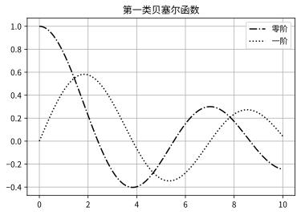

# SLM 和 CGH

## 产生任意的光场

​	我们的目标是使用 SLM 产生任意的光场, 这首先要知道目标光场的确切表达式. 假设目标光场由如下表达式描述:
$$
s(x,y)=a(x,y)\exp\left[{\rm j}\phi(x,y)\right].
$$
其中, $a(x,y)$ 表示振幅, $\phi(x,y)$ 表示相位. 它们的取值分别为 $[0,1]$ 和 $[-\pi,\pi]$. 我们的目的是将目标光场的振幅信息和相位信息同时编码在一个纯相位的 CGH 中, 入射光场经过调制后能够在目标衍射级次中得到所需的复光场. 

​	记 CGH 为 $\psi(\phi, a)$. 则 CGH 的透射函数为:
$$
h(x,y)=\exp\left[{\rm j}\psi(\phi, a)\right].
$$
该式可以用傅里叶级数展开:
$$
h(x,y)=\sum^\infty_{q=-\infty}c^a_q\exp({\rm j}q\phi),
$$
其中, 
$$
c_q^a=(2\pi)^{-1}\int^\pi_{-\pi}\exp\left[{\rm j}\psi(\phi,a)\right]\exp\left(-{\rm j}q\phi\right)~{\rm d}\phi.
$$
考虑 $q=1$ 项, 随着 $\phi$ 被积分积掉, $c_1^a$ 变得只和 $a$ 有关且和 $\phi$ 无关. 假设其满足:
$$
c_1^a =\kappa a.
$$
其中, $\kappa$ 是一个正的比例系数. 如果这样, 一级衍射光场就可以表示为 $\kappa a\exp({\rm j}\phi)$, 而这正是我们想要产生的目标光场. 要满足条件 (5), 则必须满足如下充要条件, 证明见附录.
$$
\begin{aligned}
\int^\pi_{-\pi}\sin\left[\psi(\phi,a)-\phi\right]~{\rm d}\phi &= 0,\\
\int^\pi_{-\pi}\cos\left[\psi(\phi,a)-\phi\right]~{\rm d}\phi &= 2\pi \kappa a.
\end{aligned}
$$

可以看出, 条件 (6) 中的第二个积分最大值为 $2\pi$, 所以 $\kappa$ 的最大取值只能是 1. 这个值决定了 CGH 的效率上限.

​	有了上述条件, 就可以着手计算 CGH 了. 在这里主要介绍两种算法, 它们均出自 V. Arrizón 等人的文章 *Pixelated phase computer holograms for the accurate encoding of scalar complex fields*. 其中 Arrizón 2 算法也是 *How to Shape Light with Spatial Light Modulators* 中所采用的算法. 在这里我们按照原文中两个算法出现的顺序来称这两种算法为  Arrizón 2 和 Arrizón 1 算法. 

### Arrizón 2 算法

​	令 CGH 为:
$$
\psi(\phi,a)=f(a)\sin(\phi).
$$
把 (7) 式代到 (2) 式中:
$$
h(x,y)=\exp[{\rm j}f(a)\sin(\phi)]=\sum^\infty_{m=-\infty} J_m[f(a)]\exp({\rm j}m\phi),
$$
其中 $J_m$ 表示整数阶第一类贝塞尔函数, 这里用到了 Jacobi Anger 恒等式, 其证明见附录:
$$
\exp[{\rm j}f(a)\sin(\phi)]=\sum^\infty_{m=-\infty} J_m[f(a)]\exp({\rm j}m\phi).
$$
(8) 式和 (3) 式对比系数可以得到:
$$
c_q^a=J_q[f(a)].
$$
只看一级衍射, 也就是只看 $q=1$ 项. 由于我们并没有定义 $f(a)$, 它的取值是任意的, 所以我们可以令其满足:
$$
c_1^a = J_1[f(a)]=\kappa a.
$$
我们可以通过数值反解 (11) 式来得到 $f(a)$. 由于一阶第一类贝塞尔函数的最大值为 0.58 左右 (见后图), 所以 $\kappa$ 能取的最大值就在 0.58 左右, 其满足前面提到的 $\kappa$ 最大为 1 的条件. 这说明这是一个合法的全息图, 满足条件 (6). 至此, $\psi(\phi,a)$ 就被确定下来了. 

​	这种算法只需要 SLM 的相位调制深度达到 $1.17\pi$ 即可使用, 能够增加 SLM 可以调制的波长范围, 但是会影响能量利用率. 

### Arrizón 1 算法

​	令 CGH 为:
$$
\psi(\phi,a)=\phi+f(a)\sin(\phi).
$$
利用 Jacobi Anger 恒等式 (9):
$$
\begin{aligned}

h(x,y)&=\exp[{\rm j}\phi+{\rm j}f(a)\sin(a)]\\
&=\exp({\rm j}\phi)\sum^\infty_{m=-\infty} J_m[f(a)]\exp({\rm j}m\phi)\\
&=\sum^\infty_{m=-\infty} J_m[f(a)]\exp[{\rm j}(m+1)\phi]

\end{aligned}
$$
(13) 式和 (3) 式对比系数可以得到:
$$
c_q^a = J_{q-1}[f(a)].
$$
同样做类似的处理, 得到以下式子来确定 $f(a)$:
$$
c_1^a = J_0[f(a)]=\kappa a.
$$
​	不同于一阶贝塞尔函数, 零阶贝塞尔函数的最大值为 1. 所以一般情况下该算法的能量利用率要更高, 缺点是 SLM 的调制深度要达到 $2\pi$ 才能使用. 

​	但是在其他文章 (Clark2016) 中提到了该算法的产生的光场信噪比较 Arrizón 2 算法差, 同时我们在实验中可以用提高激光功率的办法来间接解决效率问题. 所以一般我们采用 Arrizón 2 算法. 

## 叠加相位载波

​	当照明光通过 CGH 后, 各个衍射级次的中心点是在叠一起的, 这样我们无法区分目标光场. 特别是零级光, 其强度往往最大, 会完全盖住目标光场. 所以要设法消除除了一级衍射之外的其他所有衍射级次的光.

​	通常的做法是在 CGH 上叠加一个相位载波 (Phase Carrier, Arrizón2007) 或者闪耀光栅 (Pushkina2020), 使各衍射级次错开, 再通过一个光阑之类的设备挡住零级光和其他衍射级次. 或者也可以是叠加菲涅尔透镜, 把零级光均匀分散到整个平面中. 

​	在傅里叶光学中, 粗略来讲透镜的作用就是实现了一次傅里叶变换. 所以叠加相位载波的目的就是人为给我们的目标光场一个空间频率. 借此我们就可以用一个透镜实现傅里叶变换后, 再加一个光阑挡住除一级衍射外的所有光. 由于其实现起来相对简单而且效果已经足够好. 所以目前我们采用的是叠加相位载波的方法:
$$
h_c(x,y)=\sum_{q=-\infty}^{\infty}h_q(x,y)\exp[{\rm j}2\pi q(u_0x+v_0y)].
$$
其中, $h_c(x,y)$ 表示修改后的 CGH, 而 $h_q(x,y)$ 表示修改前的 CGH. 其傅里叶变换写为:
$$
H_c(u, v)=\sum_{q=-\infin}^{\infin}H_q(u-qu_0, v-qv_0).
$$

其中应用了傅里叶变换的位移定理:
$$
\mathscr{F}\left[e^{{\rm j}\omega_0 t}f(x)\right]=F(\omega-\omega_0)
$$
不难看出修改后的 CGH 产生的光场被按照 *q* 分开了. 

## 模式分解

​	在前面的描述中, 我们都是讨论任意光场的生成. 但是我们的目标并不是生成任意想要的模式, 而是要把光场分解到想要的模式之上. 对于光场生成和模式分解最显著的区别在生成任意光场要求 SLM 被平顶光照明 (top-hat beam), 也就是入射光场为 1. 而模式分解不要求光场具有某种形式, 因为我们目标是研究一个任意光场中的模式的占比.

<!--  -->

​	模式分解亦可用上述算法生成的 CGH 来实现. 假设入射光场为 $U(x,y)$, 而我们要将其分解到$\{\Psi_n(x,y)\}$上:
$$
U(x,y) = \sum_{n=1}^\infty c_n\Psi_n(x,y).
$$
不同的模式之间满足正交性条件:
$$
\left \langle {\Psi_n}|{\Psi_m} \right \rangle =\iint\Psi_n^*(x,y)\Psi_m(x,y)~{\rm d} x~{\rm d} y=\delta_{nm}.
$$
如果光场模式是量子化的, 也就是用光子落在某个坐标区间的概率来表示的话, $c_n$ 也满足归一化条件: (注意如果光场是用一些经典的量, 比如电场强度来作为单位的, 则不需要满足归一化条件)
$$
\sum_{n=1}^\infty|{c_n}|^2 = 1.
$$
利用正交性条件, $c_n$ 可以由下式算出:
$$
\left \langle {\Psi_n}|{U} \right \rangle=\iint\bra{\Psi_n}\sum_{m=1}^\infty c_m\ket{\Psi_m}~{\rm d} x~{\rm d} y=c_n.
$$
​	以 Arrizón 2 算法生成的 CGH 为例. 利用 (8) 和 (11) 式, 且只看 $m=1$ 项:
$$
h(x,y)=\kappa a\exp({\rm j}\phi). 
$$
在 $U(x,y)$ 通过 CGH 后,
$$
U'(x,y)= \kappa a \exp({\rm j}\phi)U(x,y).
$$
如前图所示, 如果把 SLM 放置在一个透镜的前焦面处, 并在后焦面处接收. 透镜的作用恰好是一个傅里叶变换器. 此时透镜的后焦面正好是其前焦面的傅里叶变换 (Goodman2017). 考虑后焦面 $W(F_X,F_Y)$:
$$
W(F_X,F_Y)=A_0\iint U'(x,y)\exp\left[-{\rm j}\frac{ k_0}{f}(xF_X+yF_Y)\right]~{\rm d} x~{\rm d} y.
$$
其中 $A_0$ 是一个常数. 在 $F_X,F_Y=0$ 的点:
$$
I(0,0) = \left|{W(0,0)}\right|^2={|A_0|}^2\left|{\iint a \exp({\rm j}\phi)U(x,y)~{\rm d} x~{\rm d} y}\right|^2={|A_0|}^2{|\left \langle {\Psi_n}|{U} \right \rangle|}^2\propto |{c_n}|^2.
$$
​	结合前面提到的叠加相位载波的技术, 可以让探测的点从 $(0,0)$ 移到任意的一个位置上. 从而只需要在后焦面探测该点的强度, 就可以测得模式分解后叠加系数.

## 附录

### 条件 (6) 证明

​	利用欧拉公式, (4) 式可以写为:
$$
c_q^a=(2\pi)^{-1}\int_{-\pi}^{\pi}\cos(\psi-q\phi)+{\rm j}\sin(\psi-q\phi)~{\rm d} \phi.
$$
要使 (5) 式成立, 则:
$$
\kappa a =(2\pi)^{-1}\int_{-\pi}^{\pi}\cos(\psi-q\phi)~{\rm d} \phi+{\rm j}(2\pi)^{-1}\int_{-\pi}^{\pi}\sin(\psi-q\phi)~{\rm d} \phi.
$$
该式等号成立的充分且必要条件是等号两边的实部和虚部相等, 也就是要满足充要条件 (6). 命题得证. 

### Jacobi Anger 恒等式的证明

​	由整数阶贝塞尔函数的母函数:
$$
\exp\left[\frac12x(z-\frac1z)\right]=\sum_{m=-\infty}^\infty J_m(x)z^m\qquad(0<|z|<\infty).
$$
令 $z=\exp({{\rm j}\phi}), x=f(a)$, 结合欧拉公式 ${\rm j}\sin x=(e^{{\rm j}\phi}-e^{-{\rm j}\phi})/2$:
$$
\exp[{\rm j}f(a)\sin\phi]=\sum^\infty_{m=-\infty} J_m[f(a)]\exp({\rm j}m\phi).
$$
得到了 Jacobi Anger 恒等式, 命题得证.

​	关于整数阶贝塞尔函数的母函数, 具体可参考大多数《数学物理方法》教科书. 书中一般会考虑一个例题: 将 $\exp\left[\frac12x(z-\frac1z)\right]$ 在 $z=0$ 附近邻域内展开为洛朗级数. 展开的方法大概就是将其分解成两个 *e* 指数并分别展开为洛朗级数后乘起来. 乘起来之后恰好会得到整数阶贝塞尔函数的级数表达式. 而贝塞尔函数一般会在柱函数章节仔细讨论.

## 参考文献

- Z. Yuan et al., “基于液晶空间光调制器的光场调控技术及应用进展（特邀）,” *ACTA PHOTONICA SINICA*, vol. 50, no. 11, p. 1123001, 2021, doi: 10.3788/gzxb20215011.1123001.
- V. Arrizón, U. Ruiz, R. Carrada, and L. A. González, “Pixelated phase computer holograms for the accurate encoding of scalar complex fields,” *Journal of the Optical Society of America A*, vol. 24, no. 11, p. 3500, Oct. 2007, doi: 10.1364/josaa.24.003500.
- C. Rosales-Guzmán and A. Forbes, *How to Shape Light with Spatial Light Modulators*. SPIE PRESS, 2017. doi: 10.1117/3.2281295.
- A. A. Pushkina, J. I. Costa-Filho, G. Maltese, and A. I. Lvovsky, “Comprehensive model and performance optimization of phase-only spatial light modulators,” *Measurement Science and Technology*, vol. 31, no. 12, p. 125202, Oct. 2020, doi: 10.1088/1361-6501/aba56b.
- T. W. Clark, R. F. Offer, S. Franke-Arnold, A. S. Arnold, and N. Radwell, “Comparison of beam generation techniques using a phase only spatial light modulator,” *Optics Express*, vol. 24, no. 6, p. 6249, Mar. 2016, doi: 10.1364/oe.24.006249.
- J. W. Goodman, *Introduction to Fourier optics*, Fourth edition. New York: W.H. Freeman, Macmillan Learning, 2017.